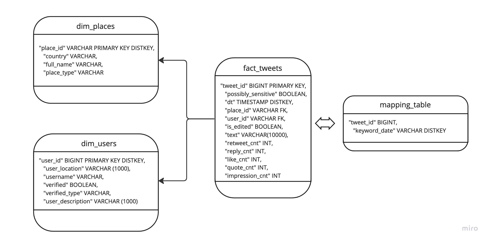

# Santal
## Daily Keyword Analysis on Twitter Data Pipeline
Santal is a data analytical pipeline built on top of Tweepy, AWS S3, Redshift and PySpark. Given a keyword and a date, Santal will pull data from Twitter using Tweepy API and store and raw JSON files in S3. Then the ETL process will extract, transform and load data into a data warehouse hosted on Redshift to enable further analysis.

</br>

## General Workflow


1. User input keyword, and Santal will pull all related tweets, along with user and geo information using Tweepy API.
2. Raw data will be stored in Amazon S3 bucket in the format of JSON.
3. Copy data to staging tables in Redshift
4. ETL process that transform data into fact/dimension tables
5. Analytical queries and aggregate the data and perform analysis.

</br>

## Database Schema


In this simpl star-schema data warehouse we have one fact table and two dimension tables, along with one mapping table. A few highlights:
- Although Redshift doesn't automatically enforce the PK uniqueness constraints, our ETL queries made sure that no duplicate records are being inserted.
- The choice of DISTKEY makes sure optimize the envisioned analytics and queries. 
- The existence of mapping table signficantly reduced the query runtime, here is an detailed explanation.
</br>

## Mapping Table
In our analysis, it is very likely that one single tweets contain two or multiple keywords of interested. Under that case, the same tweet will be pulled multiple times. It is OK if multiple records exist in our datalake (S3) in the format of JSON. However, we must make sure that records are unique in the data warehouse (Redshift). 

While this is easy to implement, it posts some challenges for our analytics. For example, if we want to look like all tweets related to "ChatGPT" on '2023-02-14', we need to write:
```
SELECT * FROM fact_Tweets WHERE text LIKE '%ChatGPT%'
AND TO_CHAR(TO_TIMESTAMP(dt,'YYYY-MM-DD HH24:MI:SS'), 'YYYY-MM-DD') = '2023-02-14'
```
where the LIKE operator is a slow pattern.

With mapping table records all mapping relationship keyword,date and tweet_id, we can quickly get a list of tweets ID given a 'keyword_date' pair. Since the daily keyword analytics is the goal of this pipeline, such operation is performed frequently, and mapping table will help speed up the queries.

```
SELECT * FROM fact_tweets t1
JOIN (
SELECT tweet_id FROM mapping_table WHERE keyword_date = 'ChatGPT_2023-02-14' GROUP BY tweet_id
) t2
ON t1.tweet_id = t2.tweet_id
```

</br>

## Scaling-up
- Scenrio#1: The data was increased by 100x.
Add more nodes to Redshift cluster. The analytical process should use EMR and Spark instead of Pandas.

- Scenrio#2: The pipelines would be run on a daily basis by 7 am every day.
Although the project is not currently using Airflow, the functional programming concepts enabled in the code make this easy. Simply turn functions to Airflow operators and set the runtime.

- Scenrio#3: The database needed to be accessed by 100+ people.
When the users num go up, they will input different keywords and make more API calls, not only the storage goes up, the network traffic also peaks up. Besides the soluton the get_data stage should utlize parllel computing and together pull data into s3.

</br>

## Automation and Quality Checks
Given the scope of this project, all data will be updated **daily**. The program will run every midnight to get data from previous day and populate the DWH. 

During the proess populating, there will be two qualicy checks implemented [here](datachecks.py).
First quality check ensure that API call is successful and data is uploaded to S3. The 2nd quality check takes place in the end of the process to make sure that all data is in-place for current keyword+date run.

</br>

## Initial Populated Data 
See [main.py](main.py), collected tweets on four different keywords in the past week.

## Demo
[ChatGPT Analysis](notebooks/Analytics.ipynb)